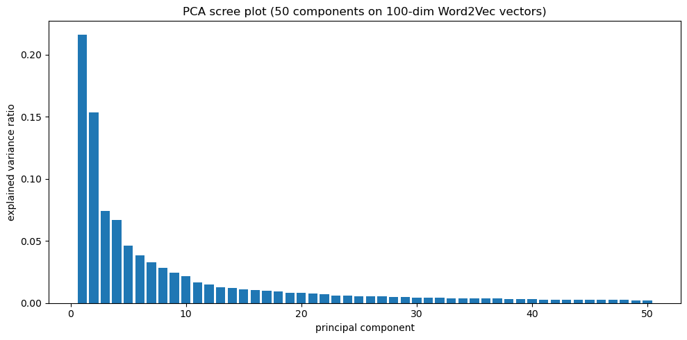
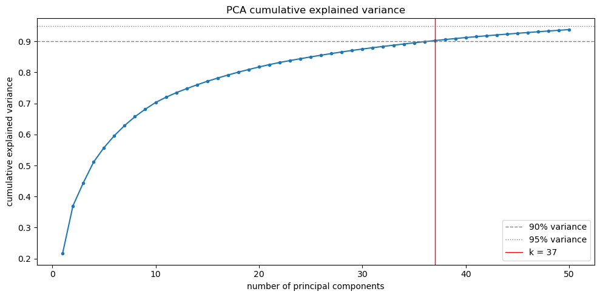
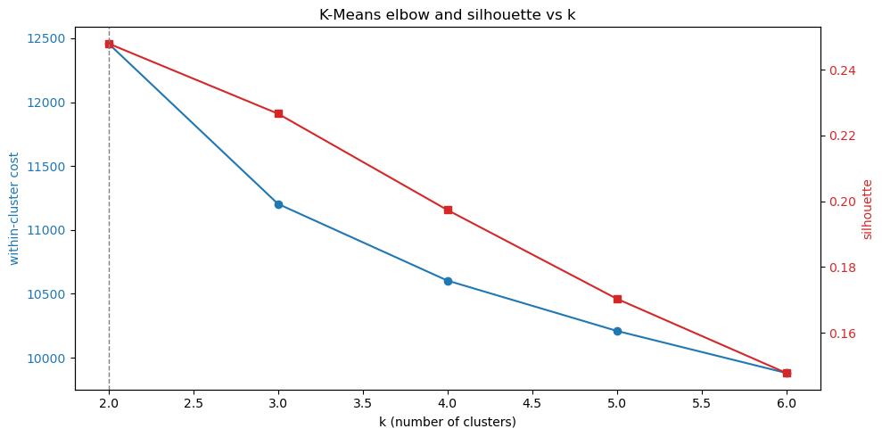
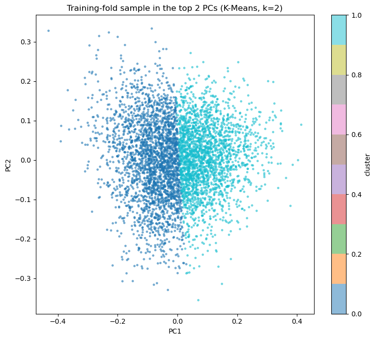
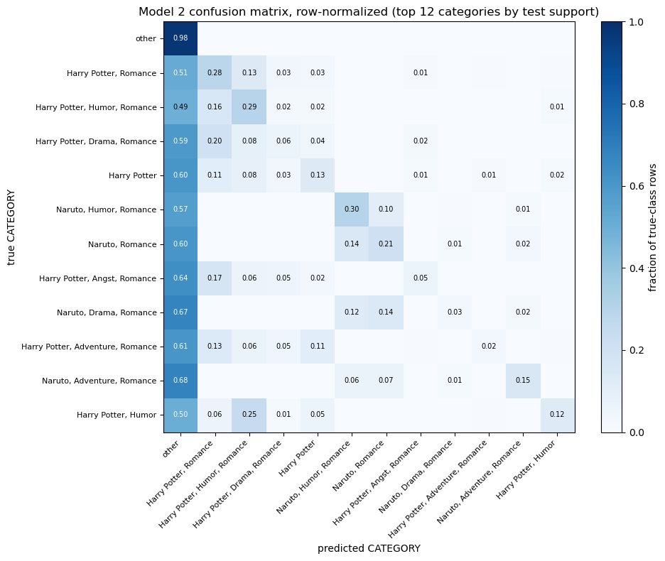

# Fanfic Spark Analysis

A distributed analysis of the [`marianna13/fanfics`](https://huggingface.co/datasets/marianna13/fanfics) corpus on SDSC Expanse, using Apache Spark to classify multilingual creative writing at scale. UCSD DSC 232R group project (Spring 2026).

**Group members:** Derek Pham and Mustafa Hayeri
**Notebook:** [`notebook/analysis.ipynb`](notebook/analysis.ipynb), best viewed through [nbviewer](https://nbviewer.org/github/fanfic-spark-group/fanfic-spark-analysis/blob/main/notebook/analysis.ipynb), since GitHub's inline renderer can time out on the embedded figures.

---

## 1. Introduction

Fanfiction is one of the largest bodies of *deliberately authored* creative writing on the internet: millions of stories written by people for the love of a fictional world, tagged by the community with the fandom and genre they belong to. That makes it a different kind of big data from the operational exhaust most large-scale ML works with, such as flight logs, sensor telemetry, transactions, or patents. Here every record is an intentional act of creative expression, and the label (`CATEGORY`) is a human-assigned statement of what the story is about. The question we ask is whether the prose itself carries enough signal to recover that label automatically: can a model read a story and predict its fandom and genre?

A good predictive model here matters beyond fan communities. Automatic classification of free-form creative text supports content recommendation, moderation, archival tagging, and cross-lingual discovery, and fanfiction (written by amateurs in 45 languages, with wildly varying length and quality) is a hard test for all of them. A model that works on this messy, long-tailed, multilingual corpus will work on cleaner data.

Why this needs big data and distributed computing. The corpus is about 186 GB: 2,018 Parquet shards, 5,252,058 rows, and individual stories that reach 93 MB of text in a single record. It does not fit in memory on a laptop, and pandas cannot open it; even the exploratory `describe` and `groupBy` passes have to stream across partitions. Reading the corpus, computing distributions, deduplicating 5.25 million rows by content hash, and fitting models on 2.74 million training documents are practical only because Spark spreads the work across the 16 cores of an SDSC Expanse node. Without a distributed engine the project could not run at all.

This README brings all milestones together into one narrative: dataset selection and abstract (M1), data exploration (M2), preprocessing and a first distributed model (M3), and a second model using dimensionality reduction plus the final analysis (M4).

---

## 2. Figures

All figures are produced in [`notebook/analysis.ipynb`](notebook/analysis.ipynb). Exploratory plots (1 to 6) run over the full 5,252,058-row corpus; Model 2 plots (7 to 11) come from the held-out folds of the preprocessed English subset.

**Plot 1.** Rows per language, log scale. 
Row count for each of the 45 distinct language tags on a log axis. English dominates by several orders of magnitude. The top six tags (`en`, `es`, `fr`, `id`, `pt`, `de`) cover over 99% of rows, with a long low-resource tail.

**Plot 2.** `text_len` distribution, linear and log10. 
Character-count distribution on a 0.1% sample (about 5K rows). Heavily right-skewed: most stories are a few thousand characters, with a tail out to multi-million-character outliers (max about 93 MB). The log10 view shows an approximately log-normal body.

**Plot 3.** `perplexity_score` distribution, linear and log10. 
Baseline-LM predictability score. A few extreme high-perplexity outliers (max about 70,000) dominate the linear view; the log10 view shows the bulk of the corpus in a narrow band.

**Plot 4.** Top-25 categories by row count. 
Of 278,388 distinct `CATEGORY` values, the empty string is the single largest (242,546 rows, a data-quality artifact). After it, the named fandoms (Harry Potter, Naruto, and so on) outweigh the tail by one to two orders of magnitude.

**Plot 5.** `text_len` by top-5 languages. 
Mean `text_len` with standard-deviation bars and median markers, for the five most frequent languages. The gap between mean and median reflects the per-language right skew.

**Plot 6.** `text_len` versus `perplexity_score`. 
Scatter (log-x, log-y) on a 0.1% sample with the Pearson correlation printed. The weak correlation indicates the two numeric features carry largely independent signal.

**Plot 7.** PCA scree, per-component variance. 
Proportion of variance explained by each of the 50 principal components of the 100-dim Word2Vec space, largest to smallest. PC1 is about 0.216, then a steep drop into a flat tail.

**Plot 8.** PCA cumulative variance and choice of *k*. 
Cumulative explained variance against the number of components. 90% is reached at 37 components (the deployed cut); the full 50 components reach 93.8%.

**Plot 9.** K-Means elbow and silhouette. 
Within-cluster cost (elbow) and silhouette over *k* = 2 to 6 on a 274,696-row training sample. Silhouette peaks at k = 2 (0.248) and decays; the cost elbow is shallow.

**Plot 10.** Cluster structure in the top two principal components. 
A 5,000-row sample projected onto PC1 and PC2, coloured by K-Means cluster at the chosen *k*.

**Plot 11.** Model 2 confusion matrix. 
Row-normalized confusion matrix over the most frequent categories for the Model 2 Logistic Regression on the test fold.

**Spark UI.** Executor verification. 
The local-mode driver acts as a 16-core executor; the executors API confirms `totalCores = 16` and `isActive = True`.

---

## 3. Methods

> A summary of what was done and the parameters used. Interpretation is in §5 (Discussion). Cross-references like §6e or §10d point to the matching cells of the [notebook](notebook/analysis.ipynb).

### 3.1 Data Exploration

Computed over all 5,252,058 rows in Spark: total row count; `describe` (count, mean, stddev, min, max) and `approxQuantile` for the two numeric columns `text_len` and `perplexity_score`; `groupBy` frequency tables for `CATEGORY`, `language`, and `SOURCE`; null counts per column; and a duplicate count using the md5 hash of `TEXT` as a proxy key. Six plots (Plots 1 to 6) visualize the language imbalance, the two numeric distributions, the category long-tail, per-language length, and the length-versus-perplexity relationship.

### 3.2 Preprocessing (Spark)

Applied to the raw corpus to produce the modelling frame `df_m3`:

1. Column drop: remove `__null_dask_index__` (a Dask leftover, about 97.5% null) and `SOURCE` (constant `"Fanfiction"`).
2. Null and empty handling: drop rows with null or empty-string `CATEGORY`.
3. English subset and outlier filter: keep `language = en`, then filter `text_len` and `perplexity_score` to the §3 percentile bounds.
4. Hash deduplication: drop duplicate `TEXT` rows using an md5 hash key.
5. Class rollup: keep the 50 most frequent named `CATEGORY` values and roll the remaining tail into an `'other'` class.
6. Feature engineering and MLlib pipeline: engineer `text_len_log10` and `len_per_perplexity` in Spark SQL, then fit a four-stage pipeline: `StringIndexer` (CATEGORY to label), `Imputer` (median), `VectorAssembler`, `MinMaxScaler`.
7. Split: `randomSplit([0.7, 0.15, 0.15], seed=42)`, giving about 2,741,007 train, 588,130 validation, and 588,125 test rows. Both models reuse the same split and the same fitted `StringIndexer`.

Infrastructure. The work ran on a single SDSC Expanse JupyterLab session (16 cores, 128 GB) in Spark `local[*]` mode. Driver memory was raised to 16 GB, the vectorized Parquet reader was disabled, `spark.local.dir` was redirected to TB-scale Lustre scratch, and the 2,018 shards' heterogeneous `language` physical type (string versus INT32) was reconciled at load by reading footers, casting, and unioning with `allowMissingColumns=True`. The reason for each choice is in [Reproducing this project](#reproducing-this-project).

### 3.3 Model 1: RandomForest on numeric features

`RandomForestClassifier(featuresCol='features', labelCol='label', numTrees=20, maxDepth=5, seed=42)` on the four §3.2 numeric features (`text_len`, `perplexity_score`, `text_len_log10`, `len_per_perplexity`), evaluated on train, validation, and test with `MulticlassClassificationEvaluator` (accuracy, F1, weighted precision, weighted recall). A capacity sweep refit two variants on the same caches: deeper (`numTrees=20, maxDepth=15`) and wider (`numTrees=100, maxDepth=5`).

### 3.4 Model 2: Word2Vec → PCA → Logistic Regression + K-Means

A text-feature pipeline on the raw `TEXT` of the same §3.2 split:

```python
# Stage the text features (fit on a bounded 50k-doc sample of the train fold):
trunc     = SQLTransformer("SELECT *, substring(TEXT,1,8000) AS text_capped FROM __THIS__")
tokenizer = Tokenizer(inputCol='text_capped', outputCol='tokens_raw')
stopwords = StopWordsRemover(inputCol='tokens_raw', outputCol='tokens_all')
cap       = SQLTransformer("SELECT *, slice(tokens_all,1,1000) AS tokens FROM __THIS__")
word2vec  = Word2Vec(inputCol='tokens', outputCol='w2v',
                     vectorSize=100, minCount=50, maxIter=1, windowSize=5,
                     numPartitions=16, seed=42)
pca       = PCA(inputCol='w2v', outputCol='pcaFeatures', k=50)
```

- Dimensionality reduction (unsupervised): PCA reduces the 100-dim Word2Vec document vectors to 50 components; a `VectorSlicer` keeps the first 37 (the 90%-variance point, §10d).
- Supervised head: `LogisticRegression(featuresCol='pcaK', labelCol='label', maxIter=20, regParam=0.0)`, multinomial, evaluated on the same train/validation/test protocol as Model 1.
- Clustering: `KMeans` over *k* = 2 to 6 on a cached 10% training sample, scored by within-cluster cost and `ClusteringEvaluator` silhouette, then refit at the chosen *k* and projected onto PC1 and PC2.
- Dimensionality comparison: the same LR is refit at 37-component, 50-component, and full 100-dim Word2Vec widths to measure the effect of the reduction (§12).
- Predictions analysis: test-fold predictions decoded back to `CATEGORY`, with correct, false-positive, and false-negative examples for the largest named category and a confusion matrix (Plot 11).

---

## 4. Results

> A summary of results and figures. No interpretation; see §5.

### 4.1 Data Exploration

- 45 distinct language tags, English-dominant (about 87% of rows); the top six cover over 99%.
- `text_len` ranges from 5,001 to 93,626,685 characters and is heavily right-skewed (Plots 2, 5).
- `perplexity_score` ranges from 56.8 to 69,992 and is right-skewed (Plot 3).
- `CATEGORY` has 278,388 distinct values; the empty string is the largest at 242,546 rows (Plot 4).
- Duplicates: 337,555 rows (about 6.4%) share a `TEXT` hash. Nulls: `language` has 3,088, `SOURCE` is constant, and `__null_dask_index__` is about 97.5% null.
- `text_len` and `perplexity_score` show weak log-log correlation (Plot 6).

### 4.2 Preprocessing

From the 5,252,058-row baseline, the §3.2 filters (drop empty `CATEGORY`, English-only, percentile outlier bounds, hash dedup) yield a modelling frame of about 3,917,262 rows, split 2,741,007 / 588,130 / 588,125 (train / validation / test). The target is the 50 most frequent named categories plus `'other'`.

### 4.3 Model 1: RandomForest

| metric (test) | baseline (T=20, D=5) | deeper (T=20, D=15) | wider (T=100, D=5) |
|---|---|---|---|
| accuracy | 0.8428 | 0.8428 | 0.8428 |
| F1 | 0.7708 | 0.7708 | 0.7708 |
| weighted precision | 0.7102 | 0.7102 | 0.7102 |
| fit time | 145.1 s | 794.5 s | 181.5 s |

Train, validation, and test agree on all four metrics (gap about 0). Every §7c sample prediction across all three folds is `'other'`. The three capacity variants are identical to four decimals.

### 4.4 Model 2: Word2Vec → PCA → LR + K-Means

PCA explained variance (Plots 7, 8): PC1 is 0.216, the top 10 components reach 0.703, and all 50 reach 0.938. 90% variance is reached at 37 components (cumulative 0.9026); 95% is not reached within 50.

Logistic Regression on the 37-dim PCA features:

| metric | train | validation | test |
|---|---|---|---|
| accuracy | 0.8405 | 0.8402 | 0.8408 |
| F1 | 0.8045 | 0.8043 | 0.8052 |
| weighted precision | 0.7826 | 0.7824 | 0.7830 |
| weighted recall | 0.8405 | 0.8402 | 0.8408 |

Fit time 435.9 s; Word2Vec plus PCA fit 362.5 s.

Dimensionality reduction versus the full feature set (same LR, same split):

| features | dim | test accuracy | test F1 | fit time |
|---|---|---|---|---|
| PCA 37 (deployed) | 37 | 0.8408 | 0.8052 | 435.9 s |
| PCA 50 (all components) | 50 | 0.8431 | 0.8082 | 1061.7 s |
| Word2Vec 100 (full, pre-PCA) | 100 | 0.8424 | 0.8063 | 578.5 s |

Test accuracy and F1 vary by about 0.3 points across the three widths; the 50-component projection is the highest on both.

K-Means (Plots 9, 10): on a 274,696-row sample over *k* = 2 to 6, silhouette peaks at k = 2 (0.2479) and decreases monotonically; within-cluster cost falls smoothly with no sharp elbow.

Predictions (Plot 11): 494,521 of 588,125 test rows correct (accuracy 0.8408). For the focus category `Harry Potter, Romance`, false positives are neighbouring multi-tag Harry Potter categories (Drama, Family, Angst, Friendship, each with Romance) and `'other'`; false negatives go mostly to `'other'` and `Harry Potter, Drama, Romance`.

---

## 5. Discussion

**Data exploration.** The exploration reframed the problem right away. The 45-language, 278K-category, 93 MB-record reality is far messier than the abstract assumed (22 languages, about 6 MB records), and it forced the engineering choices that follow: the empty-string `CATEGORY` (4.6% of rows) is noise, not a class; the category long-tail (Plot 4) makes a flat 278K-way classifier hopeless, so we restrict to the top 50 plus `'other'`; and the mega-records (Plot 2) are why the vectorized reader is disabled and `text_len` is capped. We trust these findings because they are computed over the entire corpus, not a sample.

**Preprocessing.** The most defensible choice is hash-based deduplication: about 6.4% of rows are exact `TEXT` duplicates, and leaving them in would leak content across the train/test split. The most consequential choice, and the most debatable, is the English-only restriction. It makes the modelling tractable and matches the data's 87% English skew, but it sets aside the abstract's cross-lingual ambition, which we flag as the clearest shortcoming and the most natural extension (§6).

**Model 1.** Model 1 lands exactly where §8 argues it must, at the majority-class floor. Test accuracy (0.8428) equals the `'other'` share because the model predicts `'other'` for everything, and F1 (0.7708) trails accuracy because it averages over the 50 named classes the model never predicts. The capacity sweep is the key evidence: a 15-deep forest has the capacity to memorize fine structure, yet it matches the 5-deep forest on every generalization metric. That null result is strong evidence that the bottleneck is feature information, not model capacity. Length and predictability do not encode which fandom a story belongs to; `Harry Potter, Romance` and `Naruto, Romance` have near-identical length-by-perplexity envelopes.

**Model 2.** Model 2 acted on that diagnosis and confirmed it. Replacing the four numeric features with dense Word2Vec prose embeddings raised F1 from 0.7708 to 0.8052 and weighted precision from 0.7102 to 0.7830, and the model began to predict named fandoms instead of labelling everything `'other'`. The confusion matrix (Plot 11) keeps that in perspective: `'other'` recall stays at 0.98, while 0.5 to 0.7 of each named class still lands in `'other'`, and the diagonal reaches only about 0.30 even for the best-recovered fandoms. Model 2 reduces the pull of the majority class rather than escaping it. The telling detail is that test accuracy dips a hair below Model 1's (0.8408 versus 0.8428): Model 2 trades a few majority-class freebies for genuinely modelling the minority classes, which is why F1 rises while accuracy holds. The central result of the project is that changing the feature representation helped where changing model capacity did not.

The PCA step costs almost nothing. The 37-component model (90% of the Word2Vec variance) matches the full 100-dim embedding, and the 50-component projection slightly beats it (0.8431 versus 0.8424 test accuracy, §12), because PCA drops low-variance noise directions the raw embedding still carries. So the reduction is a denoising step, not a lossy compromise. The K-Means result is an honest negative: silhouette peaks at k = 2 (0.248) and decays, so the embedding has no strong multi-cluster structure and does not recover the fandom categories on its own. The supervised Logistic Regression is what extracts the signal.

**How believable is this, and what is wrong with it?** The agreement of train, validation, and test on both models, and the fixed `seed=42` split shared across them, make the comparison fair and the numbers reproducible. Three shortcomings temper the results. First, the roughly 84% `'other'` imbalance pins headline accuracy near the majority floor for any model that does not handle imbalance, so accuracy is a misleading headline here and F1 and precision are the metrics that matter. Second, the Word2Vec model is fit on a bounded 50K-document sample with `maxIter=1` and a 1,000-token cap per story, deliberate runtime levers that almost certainly leave embedding quality on the table. Third, everything runs in Spark `local[*]` mode, so the distributed training is really 16 local threads, and the speedup discussion (§14) is about realized I/O and fit optimizations rather than a controlled multi-node scaling curve.

---

## 6. Conclusion

We set out to predict a fanfiction story's fandom-and-genre label from its text, at a scale (186 GB, 5.25 million rows) that only a distributed engine can handle. Model 1 (RandomForest on numeric metadata) underfit to the majority class and showed that the bottleneck was feature information. Model 2 (Word2Vec, then PCA, then Logistic Regression) acted on that finding: dense prose embeddings raised test F1 from 0.7708 to 0.8052 and began to recover the major fandoms, though, as the confusion matrix shows, most instances still default to `'other'`. The unsupervised PCA reduction to 37 dimensions kept accuracy intact, and at 50 dimensions slightly improved it. K-Means found only weak cluster structure, which confirms the signal is supervised, not geometric.

**What we would do differently, and explore next.** The single highest-value change is handling the class imbalance, with inverse-frequency `weightCol` or resampling, which is the binding ceiling on accuracy for both models and which we left untouched. Beyond that: a stronger Word2Vec fit (more documents, more iterations, larger vectors), a supervised reduction such as LDA that keeps label-separating directions rather than high-variance ones, and the cross-lingual evaluation the English-only filter set aside.

**What we learned about big data.** Working at this scale changed the order of our decisions: infrastructure came first. The biggest wins were data-engineering ones, not modelling ones: disabling the vectorized Parquet reader to survive 93 MB records, redirecting shuffle scratch to Lustre, deduplicating on a 32-byte hash instead of multi-MB strings, and capping text before tokenizing to bound the dominant cost. Spark was not an optimization here but a prerequisite; the corpus cannot be processed on a single machine. The work also showed where parallelism stops helping: PCA's covariance SVD and the final coefficient collect run on the driver, a serial fraction that caps the achievable speedup (§14).

---

## 7. Statement of Collaboration

**Derek Pham: Analysis and Report Lead.** Derek originated the project's direction: he chose the dataset and the framing that anchors it (fanfiction as deliberately authored creative writing rather than operational data) and wrote the Milestone 1 abstract around it. He owned the written report, reorganizing the final README into the Introduction, Figures, Methods, Results, Discussion, and Conclusion sections the submission requires. In the notebook he wrote the Model 2 fitting analysis (§12, including the dimensionality-reduction-versus-full-feature comparison), the combined conclusion for both models (§13), and the speedup and scaling analysis (§14). He extracted and captioned the report's figures and checked each write-up against the Expanse run outputs, correcting the confusion-matrix reading so the analysis does not overstate Model 2's gains over the majority class. He contributed to the data exploration and first-model analysis in the earlier milestones and reviewed Mustafa's pipeline work throughout.

**Mustafa Hayeri: Modelling and Infrastructure Lead.** Mustafa owned the project's modelling and its distributed-computing execution: he wrote the notebook code and ran every model at full corpus scale on SDSC Expanse. He implemented the Milestone 3 preprocessing pipeline and the RandomForest baseline (§6, §7), then built the Model 2 pipeline of Word2Vec, PCA, Logistic Regression, and K-Means (§10, §11). He tuned the Spark session for the corpus (16 GB driver, Lustre scratch, 16 partitions) and fixed the Word2Vec driver-result-size limit the first run hit. He ran the final notebook end to end, so every result, table, and plot reflects one reproducible execution. He handled the notebook builds across the earlier milestones and the style pass over the README and notebook, and reviewed Derek's analysis against the run results.

Both members reviewed each other's work, agreed the modelling design, and collaborated throughout.

---

## Reproducing this project

### The data

Each member downloaded the corpus once with `huggingface_hub.snapshot_download` to `~/<username>/fanfic-spark-analysis/shared/fanfics/` on Expanse's Lustre filesystem. The notebook resolves the corpus path portably, so either member's run finds his own copy. The notebook's top section contains the download and environment-setup cells.

### SDSC Expanse session

| Setting | Value |
|---|---|
| Portal | [portal.expanse.sdsc.edu](https://portal.expanse.sdsc.edu/) |
| Account | `TG-SEE260003` |
| Partition | `shared` |
| Cores / Memory | 16 / 128 GB |
| Singularity image | `~/esolares/singularity_images/spark_py_latest_jupyter_dsc232r.sif` |
| Environment module | `singularitypro` |
| App | JupyterLab |

### SparkSession

```python
spark = SparkSession.builder \
    .config("spark.driver.memory", "16g") \
    .config("spark.executor.memory", "8g") \
    .config("spark.executor.instances", 15) \
    .config("spark.sql.parquet.enableVectorizedReader", "false") \
    .getOrCreate()
spark.conf.set("spark.local.dir", "/expanse/lustre/projects/uci157/$USER/spark-scratch")
```

- 16 GB driver, not 2 GB: the Expanse JupyterLab image launches Spark in `local[*]` mode, so the driver JVM is the executor; the `executor.*` settings are kept for portability to a future YARN setup but are inactive here. Sixteen concurrent tasks reading TEXT rows up to about 93 MB each need far more than the 2 GB default.
- Vectorized Parquet reader disabled: its fixed-size batch buffers overflow on about-93 MB records; row-by-row reads trade roughly 2 to 3 times the read cost for stability.
- Schema heterogeneity: 2,016 shards encode `language` as `string` and 2 encode it as `INT32`; the load cell reads footers, splits by physical type, casts, and unions with `allowMissingColumns=True`, preserving all 5,252,058 rows.

Authoritative setup guide: [`ucsd-dsc232r/group-project`](https://github.com/ucsd-dsc232r/group-project/).

---

## Submission

The final submission is the `main` branch of this repository, submitted through Gradescope; the repository is made public for the voting round. Prior milestones were submitted from their `Milestone2` and `Milestone3` branches.
