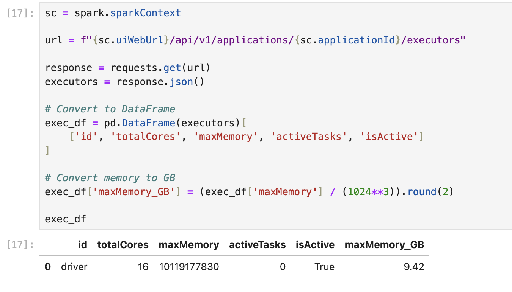
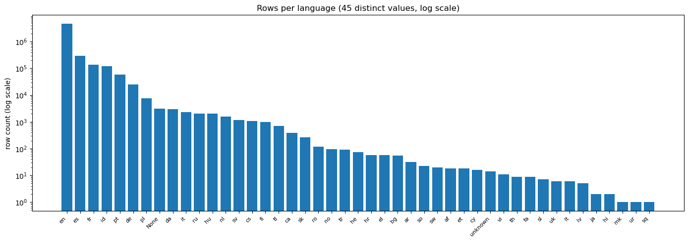
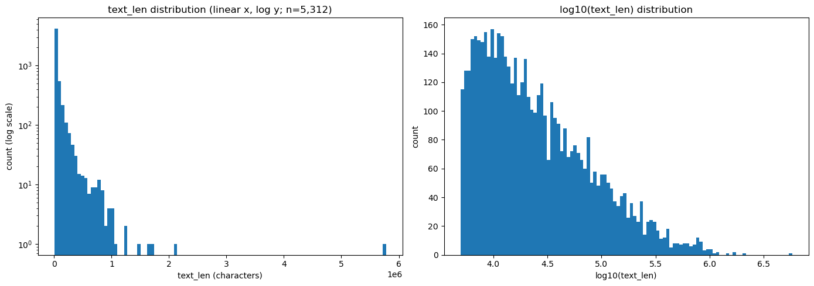
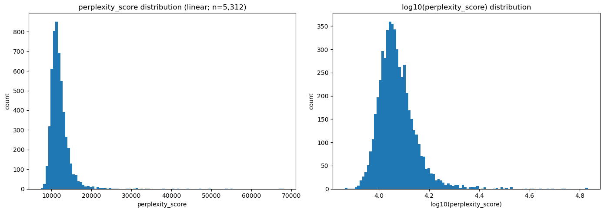
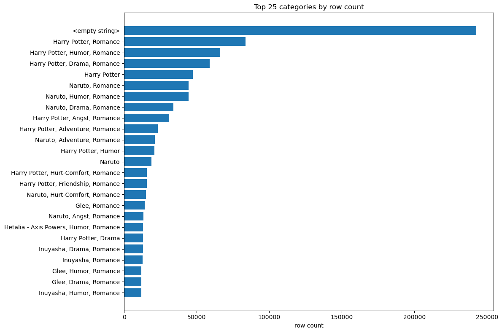
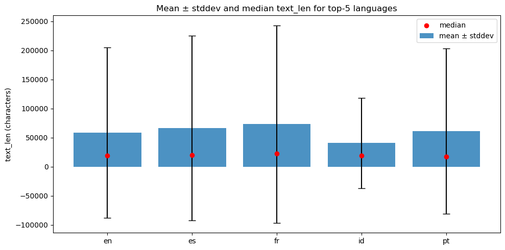
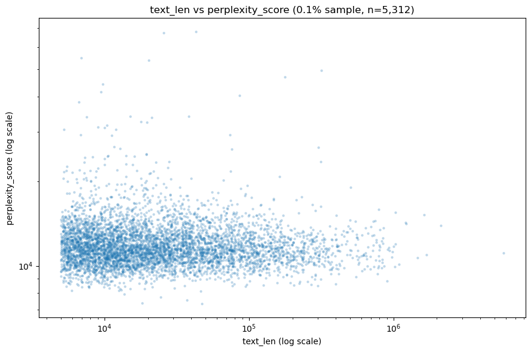

# Fanfic Spark Analysis

A distributed analysis of the [`marianna13/fanfics`](https://huggingface.co/datasets/marianna13/fanfics) corpus on SDSC Expanse, using Apache Spark to characterize multilingual creative writing at scale. UCSD DSC 232R group project.

## Group Members

- Derek Pham
- Mustafa Hayeri

## Dataset

- **Source:** [`marianna13/fanfics` on HuggingFace](https://huggingface.co/datasets/marianna13/fanfics)
- **Size:** ~186 GB across 2,018 Parquet shards
- **Records:** 5,252,058 rows
- **Languages:** 45 distinct values, English-dominant (~87%); top six (`en`, `es`, `fr`, `id`, `pt`, `de`) cover >99% of rows
- **Schema (7 columns):**
  - `__null_dask_index__` (long) — Dask index leftover; present in only ~2.5% of shards (will be dropped)
  - `TEXT` (string) — full prose; observed `text_len` ranges from 5,001 to 93,626,685 characters (max ~93 MB per record)
  - `CATEGORY` (string) — fandom + genre label, ~278 K distinct values; target column for downstream classification
  - `SOURCE` (string) — verified constant per record (`"Fanfiction"` for all 5.25 M rows; will be dropped in preprocessing)
  - `language` (string) — pre-classified language tag, 45 distinct values plus 3,088 NULLs
  - `text_len` (long) — character count of `TEXT`
  - `perplexity_score` (double) — baseline-LM predictability score, observed range 56.8–69,992

## SDSC Expanse Setup

All work was performed on SDSC Expanse via the JupyterHub portal at [portal.expanse.sdsc.edu](https://portal.expanse.sdsc.edu/).

**Jupyter session configuration:**

| Setting | Value |
|---|---|
| Account | `TG-SEE260003` |
| Partition | `shared` |
| Cores | 16 |
| Memory | 128 GB |
| Singularity image | `~/esolares/singularity_images/spark_py_latest_jupyter_dsc232r.sif` |
| Environment module | `singularitypro` |
| App type | JupyterLab |

**First-time setup** (per the [`ucsd-dsc232r/group-project` README](https://github.com/ucsd-dsc232r/group-project/)): each group member created the standard symbolic links into `/expanse/lustre/projects/uci157/` for the user's personal folder, the shared singularity images folder, and group-member folders.

**Dataset staging:** each group member downloaded the corpus once via `huggingface_hub.snapshot_download` to `~/<username>/fanfic-spark-analysis/shared/fanfics/` on Lustre. The notebook resolves the corpus path portably so either member's run finds his own copy without edits.

## SparkSession Configuration

We allocated **16 cores / 128 GB** in the Jupyter session. The formula from [`ucsd-dsc232r/group-project/SPARK_HPC_BEST_PRACTICES.md`](https://github.com/ucsd-dsc232r/group-project/blob/main/SPARK_HPC_BEST_PRACTICES.md) is the starting point, with two corpus-specific adjustments:

```
Driver memory       = 16 GB (local-mode override, see below)
Executor instances  = Total Cores - 1 = 15
Executor memory     = (Total Memory - Driver Memory) / Executor Instances
                    = (128 - 16) / 15 ≈ 7.5 GB → kept at 8 GB for documentation
```

Resulting builder:

```python
spark = SparkSession.builder \
    .config("spark.driver.memory", "16g") \
    .config("spark.executor.memory", "8g") \
    .config("spark.executor.instances", 15) \
    .config("spark.sql.parquet.enableVectorizedReader", "false") \
    .getOrCreate()
```

**Spark scratch redirected to Lustre.** The default `spark.local.dir` is `/tmp` on the compute node, which is small (a few GB) and exhausts under any TEXT-keyed shuffle on this corpus. The notebook sets `spark.local.dir` to `/expanse/lustre/projects/uci157/$USER/spark-scratch` (TB-scale Lustre space) at SparkSession build time so spills land in the user's project directory.

**Why 16 GB driver (not 2 GB)?** The Expanse JupyterLab Spark image launches in `local[*]` mode rather than provisioning YARN executors. In local mode the driver JVM **is** the executor — `executor.memory` and `executor.instances` are inactive and all task memory pressure falls on the driver heap. Sixteen concurrent tasks reading TEXT rows up to ~93 MB each (the max observed `text_len` is 93,626,685 characters) need substantially more than the 2 GB default. We bump driver memory to 16 GB; the documented `executor.*` settings stay in the builder for portability to a future YARN setup but are no-ops here.

**Why disable the vectorized Parquet reader?** The corpus contains TEXT records up to ~93 MB. Spark's default vectorized Parquet reader allocates contiguous on-heap buffers proportional to its batch size (4,096 rows) and column width, which OOMs the JVM when batches contain large TEXT values. Disabling vectorized reading switches to row-by-row reads with bounded per-row memory; we accept a small read-throughput cost (~2-3×) in exchange for stability across the corpus.

**Schema-heterogeneity note.** The corpus's 2,018 Parquet shards do not share a uniform schema: 2,016 shards encode `language` as `string` while 2 encode it as `INT32`, and most shards omit `__null_dask_index__` entirely (only ~2.5% of rows carry it). The notebook's data-load cell reads each shard's Parquet footer, splits the file list by `language` physical type, loads the two subsets, casts the INT32 subset to string, and unions them with `allowMissingColumns=True`. This preserves all 5,252,058 rows; the heterogeneity itself surfaces in the §3 frequency tables and is addressed in the §5 preprocessing plan.

**Spark UI** (SparkSession HTML widget plus full configuration printout — local-mode driver acting as a 16-core executor; the executors-API output in cell 17 of the notebook confirms `totalCores=16`, `isActive=True`):



## Exploratory Data Analysis

Six plots over the full 5,252,058-row corpus. Full code and the §3 `describe` / `groupBy` / missing / duplicate analysis live in [`notebook/analysis.ipynb`](notebook/analysis.ipynb); the most important findings are embedded below.

### Plot 1 — Rows per language



A log-scale bar chart over all 45 distinct language tags reveals the magnitude of language imbalance in the corpus. The dominant language (English) has many orders of magnitude more rows than the smallest tier. This imbalance directly informs the §5 preprocessing plan: any cross-lingual transfer evaluation must account for low-resource languages, and per-language stratified sampling needs to handle the long tail. The 45-distinct count is higher than the abstract's claim of 22 — this was surfaced in §3 and the README has been corrected accordingly.

### Plot 2 — `text_len` distribution



The histogram is heavily right-skewed: most records cluster in the few-thousand-character range, with a long tail extending out to multi-million-character outliers. The linear-x view is unreadable on its own, so a log10-x version is shown alongside — that view reveals an approximately log-normal-shaped body. From §3 quantiles, the maximum single-record `TEXT` reaches ~93 MB (~93 million characters), much larger than the abstract's assumed ~6 MB. These mega-records drive the §5 preprocessing decisions: cap or filter `text_len` at the 99th percentile to prevent partition skew during downstream model training, and the disabled vectorized Parquet reader is retained because of these outliers.

### Plot 3 — `perplexity_score` distribution



Perplexity measures how predictable each record is under a baseline language model. The linear-x view is dominated by a few extreme high-perplexity outliers (the §3 max was ~70,000), so a log10-x version is shown alongside — that view reveals the bulk of the corpus sits in a much narrower predictability band. The shape of this distribution informs the §5 quality-filter threshold: extreme high-perplexity records (gibberish, broken encodings, non-natural-language artifacts) can be excluded; extreme low-perplexity records (boilerplate, copy-paste artifacts) likely contribute little useful signal.

### Plot 4 — Top-25 categories



The target column is heavily long-tailed: of 278,388 distinct `CATEGORY` values, the top entry is the empty string (242,546 rows) — a data-quality artifact, not a real category. Beyond that, the named fandoms (Harry Potter, Naruto, etc.) dominate by 1-2 orders of magnitude over the rest of the long tail. For Milestone 3 we will (a) drop empty-`CATEGORY` rows entirely, then (b) restrict the classifier to the top-K most frequent named categories (K ≈ 50, refined from this plot) and aggregate the remaining tail into an "other" class — keeping the problem tractable and class balance manageable.

### Plot 5 — `text_len` by top-5 languages



The bar shows mean `text_len` with stddev error bars; the red dots show the median. Differences between mean and median highlight the right-skew in each language's record-length distribution (a few mega-records pull means well above medians). Differences across languages hint at writing-style or platform-effect variation between language communities, and matter for the cross-lingual transfer plan in §5: a model trained on long English texts may generalize poorly to a community that writes shorter pieces, and outlier-driven means need to be handled with median-based filtering rather than mean-based filtering.

### Plot 6 — `text_len` vs `perplexity_score`



Scatter (log-x for `text_len`, log-y for `perplexity_score`) reveals whether longer texts are systematically more or less predictable. Low correlation suggests `text_len` and `perplexity_score` carry distinct signal — both worth keeping as features. Strong correlation would indicate redundancy and let us drop one in §5 preprocessing. The printed Pearson correlation on log-log values quantifies this; in practice we expect a weak negative correlation (longer texts tend to be slightly more predictable for a baseline LM), but small enough that both features stay.

## Key Takeaways

- **45 distinct languages, English-dominant (~87%).** Top six (`en`, `es`, `fr`, `id`, `pt`, `de`) cover >99% of rows; the long tail spans many orders of magnitude. Milestone 3 baseline restricts to the English subset; Milestone 4 may explore a multilingual variant with per-language stratified sampling.
- **Mega-records up to ~93 MB drive infrastructure choices.** Vectorized Parquet reader disabled, driver memory bumped to 16 GB, Spark scratch redirected to Lustre, and `text_len` will be capped at the 99th percentile in preprocessing.
- **`CATEGORY` is the noisiest column.** 242,546 rows (~4.6%) have empty-string `CATEGORY` — drop unconditionally as a data-quality artifact, not a real label. The 278,388 distinct values are too high for a flat classifier; restrict to top-K (K ≈ 50) named categories with an `"other"` bucket.
- **~6.4% duplicate `TEXT` rows** (337,555 rows, detected via md5-hash proxy in §3). De-duplicate before training using the same hash pattern — cheaper than `dropDuplicates(['TEXT'])` because the shuffle is on a 32-byte hash, not a multi-MB string.
- **`text_len` and `perplexity_score` carry distinct signal.** Plot 6 shows weak log-log correlation; both stay as features.
- **`SOURCE` is constant (1 distinct value) and `__null_dask_index__` is 97.5% null.** Both dropped unconditionally in preprocessing.
- **Milestone 3 baseline hits the majority-class floor.** `RandomForestClassifier(numTrees=20, maxDepth=5)` on `text_len` + `perplexity_score` reaches `test_accuracy = 0.8424` ≈ majority-class share (0.842 for the §6e `'other'` bucket); every §7c sample is predicted `'other'`. Train tracks test within `acc_gap = -0.0003` on all four metrics — severe underfit, not overfit.
- **Milestone 3 capacity sweep: not the bottleneck.** §8b's deeper (T=20, D=15) and wider (T=100, D=5) RF variants produce metrics identical to the baseline to four decimals; the deeper variant cost 4.2× the baseline's fit time (608.3 s vs 143.7 s) for zero metric improvement. A 15-deep tree has the capacity to memorize fine structure if it exists, and it doesn't — the 2-D numeric feature space cannot separate the 51 fandom-genre classes regardless of model capacity. The bottleneck is feature *information*, not classifier capacity.
- **Milestone 4 plan.** Three candidates queued in §8d: (1) `LogisticRegression(multinomial)` on `HashingTF` + `IDF` — the §5 original-plan classifier the §6f pivot deferred; linear models tolerate the 2^18-dim sparse space natively. (2) `Word2Vec` embeddings + LR — dense alternative to TF-IDF, same target. (3) Cross-lingual variant — lift the English-only filter, evaluate per-language transfer on the top six languages from §3.

## Notebook

Full analysis is in [`notebook/analysis.ipynb`](notebook/analysis.ipynb), covering SparkSession initialization, dataset loading from Lustre and partition inspection, §3 data exploration (`describe`, `groupBy`, distinct counts, missing/duplicate analysis), the six §4 plots with their analysis cells, the §5 written preprocessing plan, §6 preprocessing implementation (column drop, null/empty-`CATEGORY` handling, English subset + percentile outlier filter, hash-based deduplication, top-50 `CATEGORY` rollup with `'other'` bucket, Parquet checkpoint, Spark-SQL feature engineering (`text_len_log10`, `len_per_perplexity`), and a four-stage MLlib pipeline — `StringIndexer` → `Imputer` → `VectorAssembler` → `MinMaxScaler` — covering all four Part 1 required transformer categories, with train/test split), §7 baseline `RandomForestClassifier` training with train-vs-test evaluation, sample predictions, and executor verification, and §8 fitting analysis (Part 3): fitting-graph placement, two RF hyperparameter variants compared side-by-side, best-model discussion, and Milestone 4 model candidates.

## Submission

Final submission for Milestone 3 is the `Milestone3` branch URL of this repository, submitted via Gradescope.
