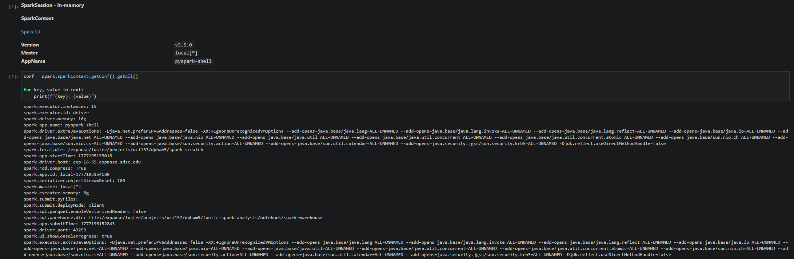

# Fanfic Spark Analysis

A distributed analysis of the [`marianna13/fanfics`](https://huggingface.co/datasets/marianna13/fanfics) corpus on SDSC Expanse, using Apache Spark to characterize multilingual creative writing at scale. UCSD DSC 232R group project.

## Group Members

- Derek Pham
- Mustafa Hayeri

## Dataset

- **Source:** [`marianna13/fanfics` on HuggingFace](https://huggingface.co/datasets/marianna13/fanfics)
- **Size:** ~186 GB across 1,047 Parquet shards
- **Records:** 5,252,058 rows, 22 languages
- **Schema (7 columns):**
  - `__null_dask_index__` (long) — Dask index leftover; will be dropped
  - `TEXT` (string) — full prose, up to ~6 MB per record
  - `CATEGORY` (string) — fandom + genre label (target column for downstream classification)
  - `SOURCE` (string) — verified constant per record (will be dropped in preprocessing)
  - `language` (string) — pre-classified language tag (22 distinct values)
  - `text_len` (long) — character count of `TEXT`
  - `perplexity_score` (double) — baseline-LM predictability score

## SDSC Expanse Setup

All work was performed on SDSC Expanse via the JupyterHub portal at [portal.expanse.sdsc.edu](https://portal.expanse.sdsc.edu/).

**Jupyter session configuration:**

| Setting | Value |
|---|---|
| Account | `TG-SEE260003` |
| Partition | `shared` |
| Cores | 16 |
| Memory | 128 GB |
| Singularity image | `~/esolares/singularity_images/spark_py_latest_jupyter_dsc232r.sif` |
| Environment module | `singularitypro` |
| App type | JupyterLab |

**First-time setup** (per the [`ucsd-dsc232r/group-project` README](https://github.com/ucsd-dsc232r/group-project/)): each group member created the standard symbolic links into `/expanse/lustre/projects/uci157/` for the user's personal folder, the shared singularity images folder, and group-member folders.

**Dataset staging:** each group member downloaded the corpus once via `huggingface_hub.snapshot_download` to `~/<username>/fanfic-spark-analysis/shared/fanfics/` on Lustre. The notebook resolves the corpus path portably so either member's run finds his own copy without edits.

## SparkSession Configuration

We allocated **16 cores / 128 GB** in the Jupyter session. Following the formula from [`ucsd-dsc232r/group-project/SPARK_HPC_BEST_PRACTICES.md`](https://github.com/ucsd-dsc232r/group-project/blob/main/SPARK_HPC_BEST_PRACTICES.md):

```
Driver memory       = 4 GB (interactive-Jupyter exception, see below)
Executor instances  = Total Cores - 1 = 15
Executor memory     = (Total Memory - Driver Memory) / Executor Instances
                    = (128 - 4) / 15 ≈ 8.3 GB → rounded to 8 GB
```

Resulting builder:

```python
spark = SparkSession.builder \
    .config("spark.driver.memory", "4g") \
    .config("spark.executor.memory", "8g") \
    .config("spark.executor.instances", 15) \
    .getOrCreate()
```

**Why 4 GB driver (not 2 GB)?** `SPARK_HPC_BEST_PRACTICES.md` lists interactive Jupyter analysis as one of the documented exception cases for raising driver memory above the 2 GB default. The fanfics corpus has heterogeneous Parquet schemas across its 1,047 shards (`language` is encoded as string in most shards but as INT32 in some), which the data-load cell handles by reading each subset and unioning them with type normalization. The resulting logical plan is large enough that the 2 GB driver ran out of headroom during interactive aggregations. Bumping to 4 GB gives the driver room for plan compilation and broadcast metadata while keeping executor memory comfortable at 8 GB × 15.

**Spark UI screenshot** (parallel task dispatch during the §3c deduplication shuffle):



## Notebook

Full data exploration is in [`notebook/analysis.ipynb`](notebook/analysis.ipynb), covering:

1. SparkSession initialization and configuration verification
2. Dataset loading from Lustre and partition inspection
3. Data exploration via Spark DataFrames (count, schema, describe, group-by aggregations, distinct counts, missing/duplicate analysis)
4. Distribution plots (language frequency, text-length distribution, perplexity distribution, top categories, text-length × language, text-length × perplexity scatter)
5. Preprocessing plan for Milestone 3

## Submission

Final submission for Milestone 2 is the `Milestone2` branch URL of this repository, submitted via Gradescope.
